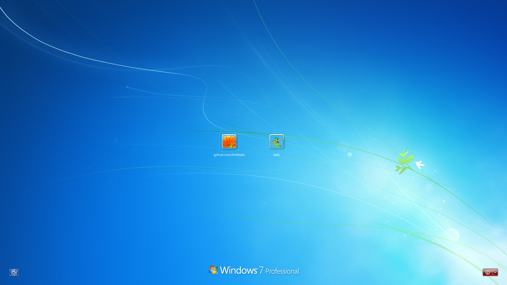

# Windows 7 Login Screen SDDM Theme

## Table of contents

1. [Gallery](#gallery)
2. [Missing Features](#missing-features)
3. [Requirement](#requirements)
4. [Installation](#installation)
   - [From KDE Plasma system settings](#from-kde-plasma-system-settings)
   - [Manual installation on KDE Plasma desktop environment](#manual-installation-on-kde-plasma-desktop-environment)
   - [If you're not using KDE Plasma](#if-youre-not-using-kde-plasma)
5. [Kiosk Mode](#kiosk-mode)
   - [Configuration](#configuration)
   - [Adding a new kiosk entry](#adding-a-new-kiosk-entry)
   - [Installing kiosk sessions](#installing-kiosk-sessions)
6. [Testing](#testing)

## Gallery

<details>
  <summary>Click to view screenshots</summary>
   


</details>

## Note

Huge thanks to wackyideas for creating [Aero theme for Plasma](https://gitgud.io/wackyideas/aerothemeplasma), this SDDM theme uses some assets and codes from that theme.

## Missing Features
Missing features from Windows 7 login screen that's planned to be added in the future:

- Successful login message [(this is a SDDM bug, waiting it to be fixed)](https://github.com/sddm/sddm/issues/1960)

## Requirements

> [!CAUTION]
>Please install [Segoe UI Regular](https://github.com/microsoft/reactxp/raw/master/samples/TodoList/src/resources/fonts/SegoeUI-Regular.ttf) and
  [Segoe UI Light](https://github.com/microsoft/reactxp/raw/master/samples/TodoList/src/resources/fonts/SegoeUI-Light.ttf)
      font to use this SDDM theme!

No extra Qt packages are required for 6 and higher versions of KDE Plasma and Qt.
On XFCE or other desktop environments might require additional Qt packages. (Currently I do not know which ones are required.)

> [!IMPORTANT]
>5 and lower versions of KDE Plasma/Qt might require additional Qt packages but there are no quarantee of the theme working properly. Please do NOT open an issue if you are using older versions of KDE Plasma/Qt.

## Installation

You can use installation script to install this theme, [required fonts](#requirements) and [Windows Cursors](https://github.com/birbkeks/windows-cursors)! 

```
wget https://raw.githubusercontent.com/birbkeks/win7-sddm-theme/main/install.sh
chmod +x install.sh
./install.sh
```

> [!CAUTION]
>Please make sure to install [required fonts](#requirements) first!

### From KDE Plasma system settings:
1. Open System Settings.
2. Go to Colors & Themes and click on Login Screen (SDDM).
3. Click on "Get New..." and search for this theme, and install it from there.

### Manual installation on KDE Plasma desktop environment:
1- You can download this theme from [github releases](https://github.com/birbkeks/win7-sddm-theme/releases) or from [store.kde.org](https://store.kde.org/p/2192528/) page! <br>
2- Extract "win7-sddm-theme.tar.gz" to `/usr/share/sddm/themes`. <br>
3- Edit /etc/sddm.conf.d/kde_settings.conf  and under `[Theme]`, change `Current=` to `Current=win7-sddm-theme`.

### If you're not using KDE Plasma:
1- You can download this theme from [github releases](https://github.com/birbkeks/win7-sddm-theme/releases) or from [store.kde.org](https://store.kde.org/p/2192528/) page! <br>
2- Extract "win7-sddm-theme.tar.gz" to `/usr/share/sddm/themes`. <br>
3- Edit /etc/sddm.conf  and under `[Theme]`, change `Current=` to `Current=win7-sddm-theme`.

## Kiosk Mode

This theme supports a kiosk mode where instead of showing system users, it displays a list of launchable sessions (e.g. 86Box, ScummVM, KDE Plasma). Clicking an entry auto-logs in as a preconfigured user and starts the selected session.

Kiosk entries are auto-discovered from `.desktop` files in the `sessions/` directory inside the theme. No need to manually list them in the config.

### Configuration

Edit `theme.conf` and set the auto-login credentials under `[General]`:

```ini
kiosk_user=nacho
kiosk_pass=yourpassword
```

### Adding a new kiosk entry

1. Create a `.desktop` file in the `sessions/` directory. The **filename** (without `.desktop`) is used as the display name. The `Comment=` field is shown as a description below the name.

```ini
# sessions/My App.desktop
[Desktop Entry]
Name=My App
Comment=My app in fullscreen kiosk mode
Exec=/usr/local/bin/my-app-kiosk.sh
Type=Application
```

2. Add a matching icon at `Assets/<filename>.png` (e.g. `Assets/My App.png`). The filename must match the `.desktop` file name without the extension.

3. Re-run `install.sh` option 4 to symlink the session file, then restart SDDM.

### Installing kiosk sessions

The `.desktop` files in `sessions/` must be symlinked to `/usr/share/xsessions/` so SDDM can use them. The install script also creates `/etc/sddm.conf.d/kiosk.conf` to enable `QML_XHR_ALLOW_FILE_READ=1`, which is needed to read the `Comment=` field from `.desktop` files.

Run the install script and pick option 4:

```
./install.sh
# Select: 4
```

Or manually:

```bash
sudo ln -sf /usr/share/sddm/themes/win7-sddm-theme/sessions/*.desktop /usr/share/xsessions/

# Enable .desktop file reading for descriptions
sudo mkdir -p /etc/sddm.conf.d
echo -e "[General]\nGreeterEnvironment=QML_XHR_ALLOW_FILE_READ=1" | sudo tee /etc/sddm.conf.d/kiosk.conf

sudo systemctl restart sddm
```

## Testing

If you want to test this theme before using it, you can use this command on your terminal to test this or other SDDM themes. Make sure to replace "/path/to/directory" with the directory of SDDM theme you installed.

```
env -i HOME=$HOME DISPLAY=$DISPLAY XAUTHORITY=$XAUTHORITY sddm-greeter-qt6 --test-mode --theme /path/to/directory
```


